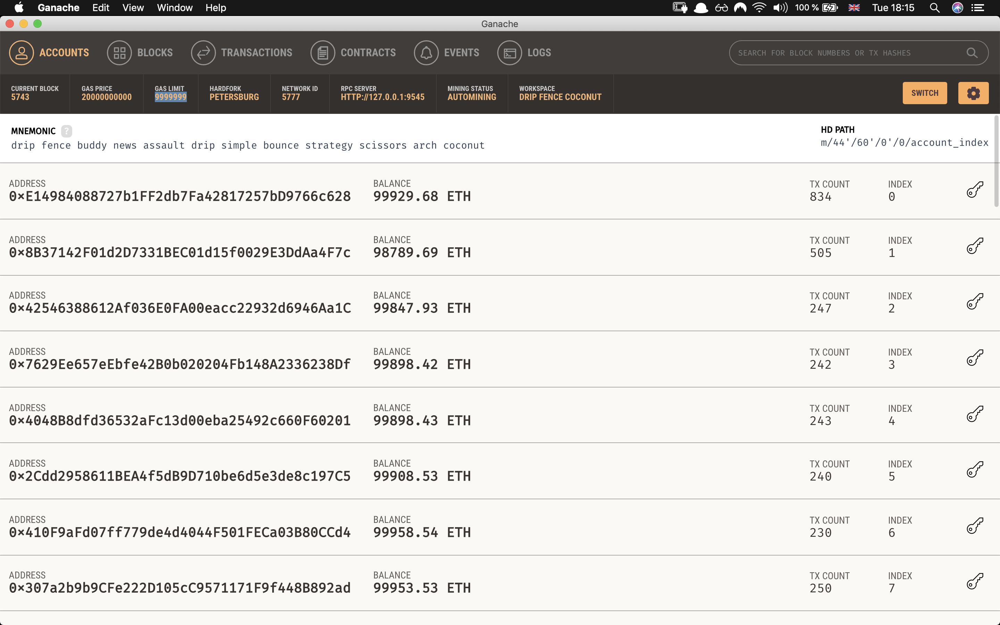
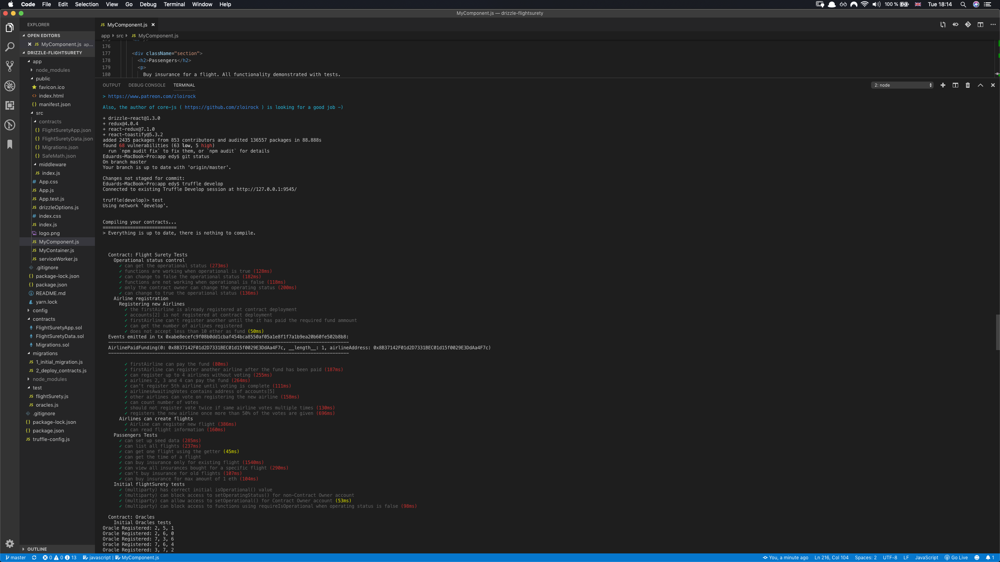
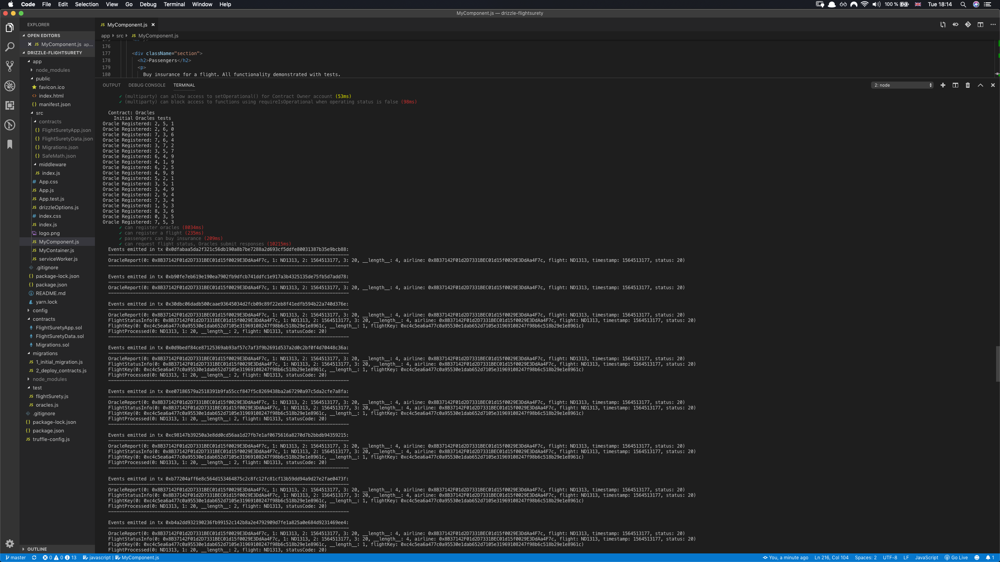
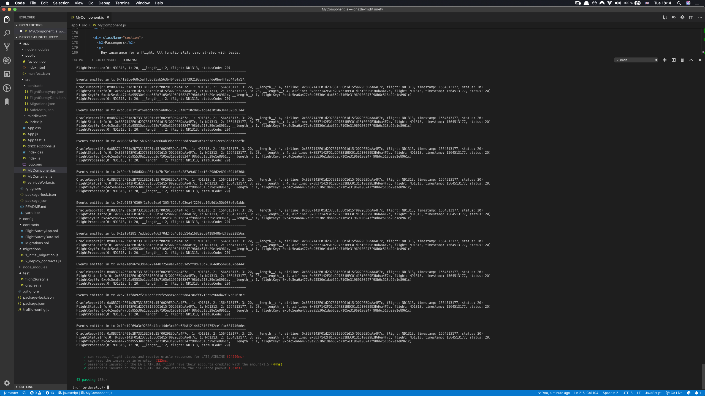
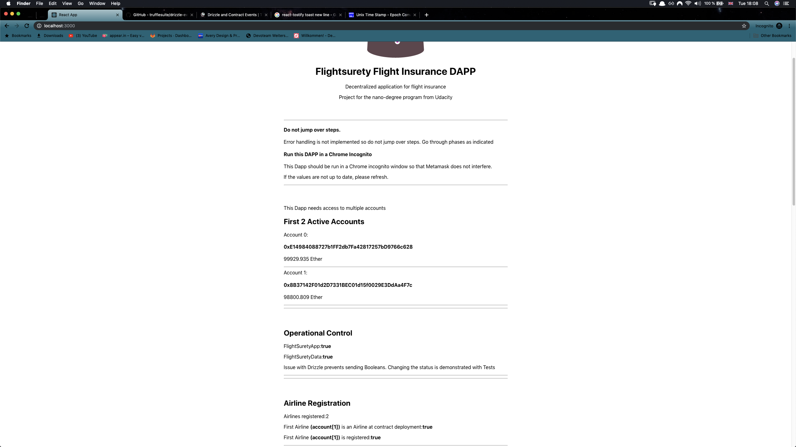
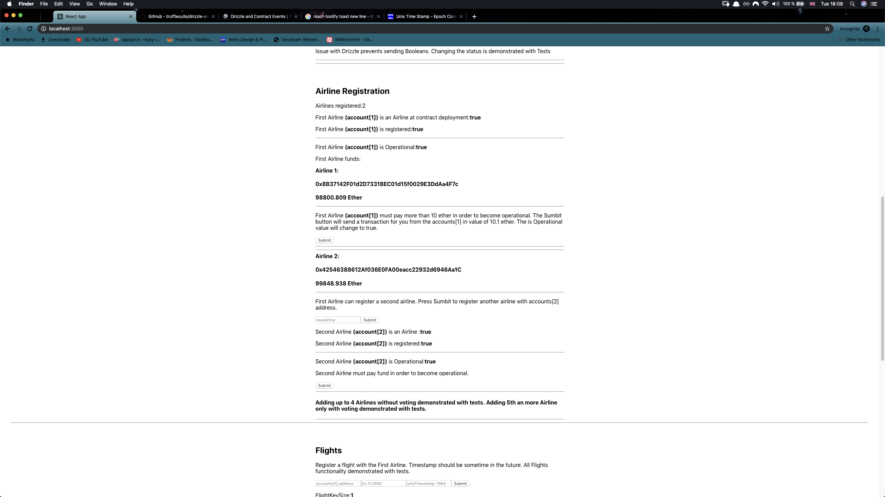
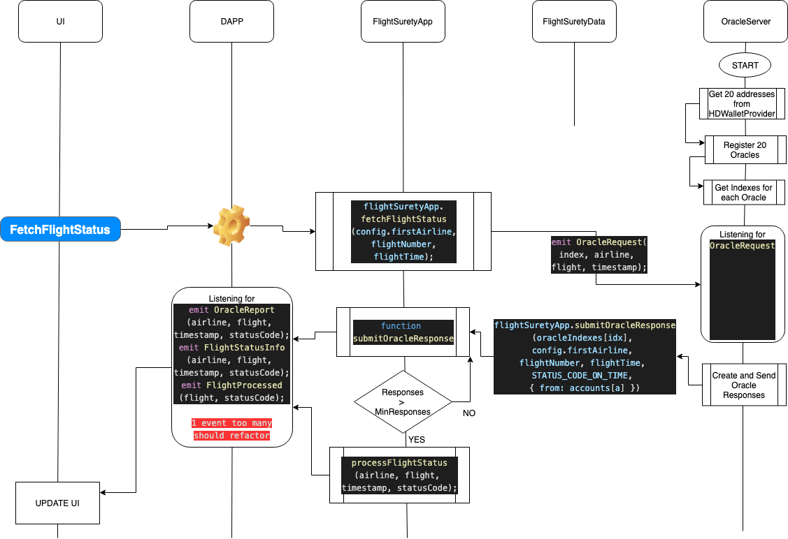

# Flightsurety 
## Decentralized flight insurance project for Udacity nanodegree program
This repository contains an Ethereum DApp that shows how Flight insurance could function in an decentralized application.

This repository is just a proof of concept that only covers the requirements of the Udacity nanodegree program.

The DApp User Interface is only meant to showcase the functionality without distinguishing between roles. For ease of use the Dapp must have access to multiple unlocked accounts provided by a local instance of Ganache.

# Getting Started
These instructions will get you a copy of the project up and running on your local machine for development and testing purposes.

## Prerequisites
Please make sure you've already installed Ganache and Truffle.\
The Dapp should be opened in a browser window that does not make use of Metamask( like Chrome Incognito mode ).

#### Ganache Prerequisites
Ganache must run on the local machine on port 9545.
Some transactions require transferring large amounts of ether. You must have set up ganache so that you have enough to run all the functions.
Some tests make use of up to 20 accounts. You must set up Ganache so that it provides at least 50 accounts.
Ganache gas limit must be set high so that it does not interfere with deploying the contracts.
Here is a Screenshot of my Ganache instance:

## Installing

Clone this repository: `https://github.com/eandrasi/drizzle-flightsurety.git`\
cd into the folder\
Install using `npm install`\
cd into the app folder `cd app`\
Install using `npm install`\
Launch Ganache with the settings described above\
In a separate terminal window, launch the truffle developer console: `truffle develop`\
Compile all the smart-contracts: `truffle compile`\
Deploy the smart-contracts to your running Ganache: `truffle migrate --reset`\

### Testing the smart-contracts
Open a terminal in the project root and enter the truffle developer console `truffle develop`\
Run the tests with: `test`\
All tests should pass. If there are error check the Ganache prerequisites described in this document.\
You should se something like this:

## Running the Dapp
Open another terminal and go to the app folder `cd app` \
Make sure your contracts are compiled and deployed to local Ganache \
Install the app by running `npm install` inside the app folder \
Run the Dapp `npm run start` \
Open a chrome incognito window \
Go to: http://localhost:3000/ \
You should see something like this:
## User interface 

The user interface only contains basic functions.
For easy testing only view the Dapp in an incognito window, or a browser that does not use Metamask. The web 3 should be injected by the framework.

## Oracle Responses
In this instance of the Dapp Oracles must be registered manually, listen for events and respond to the requests on a per case basis.
The will be generated by the user through the provided interface
The following diagram describes the Oracle Server desired funtionality.

# Built With
+ Ethereum - Ethereum is a decentralized platform that runs smart contracts
+ IPFS - IPFS is the Distributed Web | A peer-to-peer hypermedia protocol to make the web faster, safer, and more open.
+ Truffle Framework - Truffle is the most popular development framework for Ethereum with a mission to make your life a whole lot easier.
+ openzeppelin-solidity
+ truffle-assertions
+ drizzle
+ drizzle-react
+ drizzle-react-components
+ react
+ react-dom
+ react-scripts
+ react-toastify

# Authors
Eduard Andrasi

# Acknowledgments
+ Solidity
+ Ganache-cli
+ Truffle
+ Drizzle
+ React